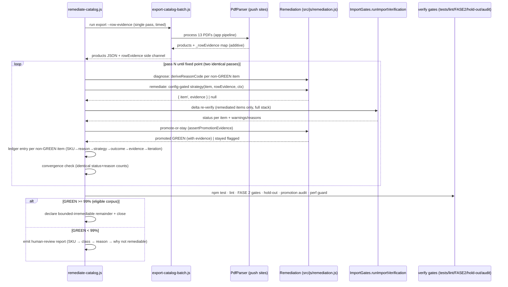

# Design: Catalog Remediation Loop

## Technical Approach

Additive, deterministic, in-memory remediation on top of the closed FASE 2 extraction. No OCR, no new LLM, no parser rewrite, no storage/migration changes. The change turns YELLOW/RED from a *destination* into a *per-item strategy*: for every non-GREEN product — diagnose the exact atomic reason → apply the config-gated deterministic strategy for that failure class → re-run the full gate stack → promote to GREEN **only with evidence** → move on. The loop iterates to a fixed point (two identical passes), writes a per-run ledger, is idempotent on remediated exports, declares `bounded-irremediable` items honestly, and guards itself (performance/quality) plus its own generalization (hold-out, synthetic stress, anti-overfit audits).

Four slices run `1 → 2 → 3 → 4` under strict TDD (RED→GREEN→REFACTOR per `openspec/config.yaml`), each independently reviewable within the 400-line budget and chained stacked-to-main (delivery auto-chain). Fixtures derive from the FINAL5 export (n=2309: 1605 GREEN / 656 YELLOW / 48 RED).

**Core structural decision: one pure remediation engine, one orchestrator.** New `src/js/remediation.js` (browser-global + CommonJS, same convention as `ImportGates`) holds the pure strategies, the reason-code classifier, the evidence contract validator, and the already-remediated detector. New `scripts/remediate-catalog.js` (Node-only) drives the loop: export → diagnose → remediate → re-verify → promote-or-stay → ledger → verify gates → report. `quality-iterate.js` stays measure-only by default and gains a `--remediate` mode that reuses the same engine. The browser import flow is **not** modified to auto-remediate: users import the remediated export, which re-passes the unchanged `runImportVerification` composition (promoted items survive because promotion required a full-gate pass).

```
runRemediationPass(products, rowEvidenceMap, config):
  1. diagnose   — deriveReasonCode(item) per non-GREEN item → failure class
  2. remediate  — class strategy (pure, config-gated) → { item', evidence } | null
  3. re-verify  — delta-only: full gate stack on remediated items only
                  (item-level: validateItem → image-text → assignment;
                   corpus-level: validateCatalogStats once per pass)
  4. promote-or-stay — GREEN only on full-gate pass AND valid remediationEvidence;
                       else stays flagged (stayed | bounded-irremediable)
  → { products, ledger, stats }
```

## Architecture Decisions

| # | Decision | Options | Tradeoff | Choice |
| --- | ---------- | ---------- | ---------- | -------- |
| 1 | Remediation placement | Inline in `quality-iterate.js` vs new pure module | Inline = untestable in Node unit suite + browser runtime can't share it | New `src/js/remediation.js` (pure, browser-global + CommonJS), consumed by `remediate-catalog.js`, `quality-iterate.js --remediate`, and future browser use |
| 2 | Row-band text access | Re-parse PDFs per strategy vs additive `_rowEvidence` capture at the 3 existing push sites | Re-parse = 8–10 min per pass, parser coupling | Additive `_rowEvidence` (page, rowTextY, textItems, anchors, alignment) attached at the same push sites that already attach `groundingEvidence`; side-channel JSON `--row-evidence <file>` from the batch export; export JSON stays lean (evidence not embedded per product) |
| 3 | Atomic reason source | Match Spanish warning strings vs derive from structured evidence first | String matching is brittle; evidence-first requires additive fields | `deriveReasonCode(item)`: structured evidence first (`_imgTextWarnings.type`, `groundingEvidence.groundingMode`, `_outlierEvidence`, marketing-classification), Spanish string fallback for legacy reasons; both fixture-locked |
| 4 | 99% denominator | `2286 of 2309` literally vs post-import-filter corpus | 48 RED are import-filtered pre-catalog and declared bounded-irremediable (never remediable to GREEN); `2309 − 48 = 2261` eligible, target `≥ 2239` (99%) — the literal `2286/2309` is arithmetically inconsistent with 48 unfixable RED | Measure the hard criterion on the **catalog-eligible corpus** (GREEN + YELLOW after import filter): GREEN ≥ 99% of eligible; RED recorded as bounded-irremediable in the ledger and included in the human-review report; arithmetic flagged for owner confirmation (see Open Questions) |
| 5 | Calibration location | Separate calibration module vs extend the owning gates | Owning gates already hold the vocabularies and evidence shapes; a split duplicates them | Calibration lives **in the owning gate modules**: `textSanitizer.js` (marketing noun-phrase + switch classification), `imageTextGates.js` (color-ambiguity resolution), `catalogValidator.js` (outlier literal-grounding) — each config-gated so a flip restores prior behavior |
| 6 | `_rowEvidence` capture point | Browser + export always vs export only | Browser path already has row text in scope at push sites; persisting it per product bloats memory | Attach in-memory at the 3 push sites (both paths); the batch export writes the side channel **only** when `--row-evidence` is passed; the browser keeps it transient |
| 7 | Promotion audit | Reuse `measure-catalog-assignment.js` vs dedicated script | Dedicated = independent pass by construction; reuse couples audit to a measurement script | New `scripts/quality/promotion-audit.js`: ≥ 46 promoted items re-verified with an independent, from-scratch labeled pass; 0 FP required or the strategy's promotions revert |
| 8 | Config home | App storage vs repo-level JSON vs module constant | App storage = migration surface (out of scope); module constant alone can't be flipped at runtime | `src/js/remediationConfig.js` exports `DEFAULT_REMEDIATION_CONFIG` (all strategies `true`); the orchestrator deep-merges an optional repo-root `remediation-config.json` over it; flip off = prior behavior, rollback = flip + file revert |
| 9 | Delta-only re-verify | Re-run whole corpus per pass vs remediated items only | Whole corpus per pass breaks the 8–10 min budget (spec: cost guard alarms on it) | Per pass: full item-level stack only for remediated items; `validateCatalogStats` (corpus-level, O(n log n)) once per pass; guard measures and alarms on any full-corpus re-verify |
| 10 | Idempotency detection | Single global flag vs per-strategy markers | A global "was remediated" flag can mask re-flagging | Each strategy detects **its own** already-remediated state (evidence key present, variante already carries the moved token/color, code already adopted, literal grounding already `groundingMode:'literal'`); covered by fixture tests first (priority) |

## Core Loop Architecture

Per-item cycle, extending the `ImportGates.runImportVerification` chain (validation → image-text → assignment). The loop never bypasses the chain: promotion = remediated item re-runs the **same** composition and must come out GREEN.

```
per non-GREEN item (status ∈ {YELLOW, RED}, importable scope):
  diagnose   → deriveReasonCode(item)                        # atomic reason → class
  strategy   → config.remediation.strategies[class]          # disabled → skip, stays
  remediate  → strategy(item, rowEvidence, ctx)              # pure; null = no apply
  re-verify  → runImportVerification([item'])  (delta-only)  # full gate stack
  promote    → item'.status === 'GREEN'
               AND assertPromotionEvidence(item')            # contract, fail-closed
               → GREEN with remediationEvidence
  else       → stays flagged; outcome 'stayed' if a strategy ran,
               'bounded-irremediable' only after every applicable strategy
               returned null or evidence was rejected
```

Composition invariants (unchanged from reliability design): gates only degrade, ordering is fixed (validation first because `runFullValidation` rebuilds `p.warnings`), callers swap `result.products`. The loop adds one new invariant: **every non-GREEN item carries an atomic reason** (see Reason Instrumentation).

## Remediation Strategy Shapes

Every strategy is a pure, deterministic function; no I/O, no randomness, no mutation of stored data (operates on a spread clone).

```js
/**
 * @typedef {function} RemediationStrategy
 * @param {Object} item         — cloned product (in-memory)
 * @param {Object} rowEvidence  — real source artifacts captured at extraction:
 *   { page, rowTextY, textItems:[{str,x,y,width,height,page}],
 *     anchors:[{x,y,str}], alignment:{dx,dy} }
 * @param {Object} ctx          — shared context: color vocabulary, product-noun
 *   lexicon, category sets, sibling products (shared-image groups), catalog stats
 * @returns {{ item: Object, evidence: Object } | null}
 *   null = strategy does not apply → item stays flagged with its atomic reason
 */
```

`remediationEvidence` contract (mandatory on every promotion): keys are stable English names defined per strategy (below); values reference the **exact source artifact** read — the text item (with page/coordinates), the sampled pixel region, the row column, the sibling SKU. Values are never synthesized. `assertPromotionEvidence(item)` rejects promotions with missing or fabricated evidence (e.g. `actual` color ≠ the interior sample the strategy actually read) as pipeline defects.

| Atomic reason (class) | Strategy | Applies when | Evidence (stable keys) | Stays flagged when |
| --- | --- | --- | --- | --- |
| `COLOR_MISMATCH` | color-from-image | interior sample unambiguous (occupancy ≥ 35, single dominant, in color vocabulary, box-art heuristic off) → `color` = interior sample, declared color → `variante` | `{remediated:'color-from-image', actual, declared, occupancy, sampleRegion:'center-60%'}` (occupancy ≥ 35 asserted) | occupancy < 35, non-vocabulary interior, box-art WATCH |
| `COLOR_AMBIGUOUS` | variante-color-adoption | `variante` names explicit colors whose families compatibly match the photo's top interior colors (intentional design) | `{remediated:'variante-color-adoption', colorsFromVariante, photoTopColors}` | variante empty or contradictory |
| `OUTLIER_PRICE` | literal-price-regrounding | literal price token (currency/decimal pattern) inside the verified row band with alignment → outlier is a real tier; `validateCatalogStats` calibration downgrades the outlier YELLOW to advisory **only with** `_priceGroundingLiteral` evidence | `{remediated:'literal-price-regrounding', groundingMode:'literal', text, page, dy}` | no literal token, neighbor anchor, geometric-only evidence |
| `FOB_NO_LITERAL_EVIDENCE` / `FOB_UNALIGNED` | literal-anchor-search | price-like token exists in the row band, aligned with the row baseline → `grounded = true` derived from the literal (never hardcoded) | `{remediated:'literal-anchor-search', groundingMode:'literal', text, page, alignment}` | no literal token in row band; `FOB_NEIGHBOR_ANCHOR` (fused cell) never promotes |
| `MODEL_TRUNCATED` | truncation row-band repair | missing closing token exists as a separate text item in the row band (extractor drops it) | `{remediated:'truncation-repaired', before, after}` | no closing token in the row band (source-truncated) |
| `SWITCH_IN_MODEL` | switch-to-variante | switch/axis token extracted via classifier; remaining model keeps real identity (noun, code, digits); moved token → `variante` (same pattern as `sanitizeColorField`) | `{remediated:'switch-to-variante', moved, to:'variante'}` | remaining model identity-less |
| `MODEL_GENERIC_WORD` | row-context-disambiguation | real product code in another row column (`marca`, category, `variante`) or a sibling row | `{remediated:'row-context-disambiguation', adopted, source}` | no disambiguating evidence in row context |
| `SPEC_FRAGMENT` | code-adoption | real code in another row column or a same-row text item | `{remediated:'code-adoption', adopted, source}` | no code in the row |
| `ASPECT_MISMATCH` / `SHARED_IMAGE` | shared-image-reassign | image shared with a sibling (same hash) whose category aspect matches and brand+model identity proves the sharing is a legitimate rebrand/assignment artifact; `cat` reassigned, image-integrity gates re-run | `{remediated:'shared-image-reassign', reassignedToCategory, siblingSku, imageHash}` | cross-brand sharing without identity; genuine source-photo problem |
| `MODEL_MARKETING` (noun-phrase class) | noun-phrase-calibration (**gate fix**, not a data mutation) | calibrated gate classifies the model as a noun phrase (≤ 1 marketing adjective + product noun) → GREEN on re-verify; classification evidence emitted by the gate | `{remediated:'noun-phrase-calibration', pattern:'noun-phrase', noun, marketingWords}` | puffery stack (≥ 2 adjectives, no noun, no code) |

`bounded-irremediable`: after **every** applicable strategy returns null (or evidence is rejected), the item stays YELLOW/RED with its atomic reason, is declared bounded-irremediable (class + why), and is emitted in the human-review report. Never promoted, never silently accepted.

## Gate Calibration

### Noun-phrase calibration (MODEL_MARKETING) — `textSanitizer.js`

New pure `TextSanitizer.classifyMarketingModel(modelo)` returning `{ class, noun, marketingWords, switchToken, remainingModel }`, consumed by `assessModelQuality` and by `deriveReasonCode`. Priority order:

1. **Code present** → existing code rule, unchanged (calibration never touches it).
2. **Switch/axis token present** (`magnetic`, `hall effect`, `switch`, `axis`, colored-switch tokens) → class `switch-axis`; gate maps to YELLOW `SWITCH_IN_MODEL` with evidence `{switchToken, remainingModel}` — never `MODEL_MARKETING`.
3. **Noun phrase**: product noun present AND `marketingWords ≤ 1` → GREEN (no MODEL_MARKETING warning), evidence `{pattern:'noun-phrase', noun, marketingWords}`. (Fixes the flagship FP: "Dual Charging Dock Xbox" — 1 marketing word, noun "Dock".)
4. **Puffery stack**: `marketingWords ≥ 2` and no product noun and no code → YELLOW `MODEL_MARKETING` ("Ultra Crystalblade Gleam" stays flagged).
5. **Marketing-only name**: ≥ 1 marketing word, no noun, no code → YELLOW `MODEL_MARKETING` (existing behavior preserved).

**Product-noun vocabulary** (never brands): base list derived from category keywords (`CATEGORY_WORDS_RE` + `VALID_CATEGORIES` + structural nouns: dock, charger, hub, stand, pad, grip, case, cover, keyboard, mouse, keypad, dock, keyboard, mouse, keypad, controller, switch, headset, webcam, numpad…), extended by a **bootstrapped known-good lexicon**: `scripts/quality/bootstrap-noun-lexicon.js` harvests candidate nouns from models of products that are GREEN after gates and **survive 2 consecutive iterations**; tokens that match `KNOWN_BRANDS`/custom brands are excluded; output `scripts/quality/noun-lexicon.json` (committable, regenerable). The anti-overfit audit greps both the source and the lexicon.

### Switch/axis classification

Switch/axis tokens are product-relevant nouns, never puffery. Classified before the marketing check (priority 2); a switch-token model without a code gets `SWITCH_IN_MODEL` (actionable by switch-to-variante), with `remainingModel` for the identity check. A model carrying both a switch token and a product noun ("Gateron Red Switch 87 Keys") is classified by its real identity (noun phrase or existing spec-fragment rule), never by the puffery rule.

### Reason instrumentation (NO_OBSERVATIONS → 0)

- New `ImportGates.instrumentReasons(products)` + `assertAtomicReasons(products)` running after the three gate layers: every non-GREEN product must have a non-empty `warnings` array; `qualityReason` must not be `'Sin observaciones'` for YELLOW/RED.
- Every gate degradation site is audited to push its warning in the same branch that sets `status` (defect audit: no degradation without a reason).
- A degradation without a reason is a pipeline invariant failure → item flagged `UNCLASSIFIED_YELLOW` with reason `'Degradación sin razón atómica'`, reported as a pipeline defect, never promoted.
- The 7 legacy FINAL5 `NO_OBSERVATIONS` items are re-diagnosed by re-running the gates with instrumentation on; byReason report must show `NO_OBSERVATIONS: 0`; any item still without a derivable reason appears as `UNCLASSIFIED_YELLOW`.

### Color-ambiguity resolution — `imageTextGates.js`

- `sampleInteriorColor` additionally returns `topColors: [{name, pct}]` (top 3 buckets) — additive, pure core keeps carrying the RED tests.
- The WATCH `color-ambiguous` branch gains a calibration: when the declared multi-color families (from `variante`/`color`/`modelo`) all compatibly match the photo's top colors, the multi-color is **intentional product design** → the ambiguous warning is suppressed (benign), with labeled evidence. This is what lets `variante-color-adoption` promote honestly on re-verify.
- Box-art heuristic stays WATCH-level (no status change on doubt).

### Outlier literal-grounding calibration — `catalogValidator.js`

`validateCatalogStats`: an IQR×3 outlier carrying `_priceGroundingLiteral` (proven literal token in the row band) is a **real price tier** → the outlier warning downgrades to advisory `_statFlag` (no YELLOW) **only when literal evidence exists**. No blanket threshold change; no geometric-only evidence.

### Calibration-delta report

`scripts/quality/calibration-delta.js`: per-gate FP/FN before/after with labeled audit sample sizes (MODEL_MARKETING audit of the 111 items; color-ambiguous audit; outlier audit). Every rule change ships its labeled-audit evidence and a fixture test in `src/js/tests.js`. Fail-closed: a candidate that reduces FP by increasing FN is rejected; FP and FN must not increase after calibration.

## Loop Ledger Schema

Written per run (`remediation-ledger.json`) and included in the metrics report each iteration:

```json
{
  "run": "2026-08-13T12:00:00Z",
  "export": "export-remediated.json",
  "iteration": 3,
  "fixedPoint": true,
  "greenPct": 99.2,
  "entries": [
    {
      "sku": "8BITDO-ACC-1A2B3C4D",
      "originalReason": "MODEL_MARKETING",
      "class": "model-marketing-noun-phrase",
      "strategy": "noun-phrase-calibration",
      "outcome": "promoted",
      "evidence": {"remediated":"noun-phrase-calibration","pattern":"noun-phrase","noun":"Dock","marketingWords":1},
      "iteration": 1
    },
    {
      "sku": "AULA-TEC-5E6F7G8H",
      "originalReason": "FOB_NO_LITERAL_EVIDENCE",
      "class": "fob-literal",
      "strategy": "literal-anchor-search",
      "outcome": "stayed",
      "evidence": {"atomicReason":"FOB sin ancla literal verificada","whyNotRemediable":"Sin token literal de precio en la fila"},
      "iteration": 3
    },
    {
      "sku": "MCH-MOU-9A0B1C2D",
      "originalReason": "MODEL_MARKETING",
      "class": "model-marketing-puffery",
      "strategy": null,
      "outcome": "bounded-irremediable",
      "evidence": {"atomicReason":"MODEL_MARKETING","whyNotRemediable":"Puffery stack sin nombre de producto ni código"},
      "iteration": 3
    }
  ]
}
```

Ledger invariants: every non-GREEN item gets exactly one entry per run; `outcome ∈ {promoted, stayed, bounded-irremediable}`; promoted entries always carry non-empty evidence; per-class resolution (`class → remediated → promoted → stayed → bounded-irremediable`) reported every iteration. UI strings/reasons stay Spanish; evidence keys stay English/stable.

## Config Gating + Rollback

`src/js/remediationConfig.js`:

```js
const DEFAULT_REMEDIATION_CONFIG = {
  enabled: true,                       // false = measure-only loop (quality-iterate behavior)
  strategies: {
    colorFromImage: true,
    varianteColorAdoption: true,
    literalPriceRegrounding: true,
    literalAnchorSearch: true,
    truncationRepair: true,
    switchToVariante: true,
    rowContextDisambiguation: true,
    codeAdoption: true,
    sharedImageReassign: true,
    // config-gated calibration rules — flipping off restores pre-calibration gate behavior
    nounPhraseCalibration: true,
    colorAmbiguityResolution: true,
    outlierLiteralCalibration: true,
    reasonInstrumentation: true,
  },
};
```

- The orchestrator deep-merges an optional repo-root `remediation-config.json` over the default; no app storage, no migration surface.
- A disabled strategy never runs; `enabled:false` = diagnose + measure only, identical to the current `quality-iterate.js`.
- Rollback = config flip + reverting the remediation file set; no storage/migration delta exists. Stored catalogs are untouched (remediation is a read-only post-processing layer over extraction).

## Loop Orchestration — `scripts/remediate-catalog.js`

```
1. EXPORT   run export-catalog-batch.js with --row-evidence <tmp> (single pass,
            same pipeline as the app; measures elapsed time for the perf guard)
2. LOAD     products JSON + rowEvidence side channel
3. LOOP     pass N:
              diagnose → remediate → re-verify (delta-only) → promote-or-stay
              ledger entries for every non-GREEN item
              if pass N and pass N-1 produce identical per-status AND per-reason
              counts → fixed point candidate; confirm with one more identical
              pass → terminate; else continue
4. IDEMPOTENCY  re-run on an already-remediated export = no-op: every strategy
            detects its own already-remediated state (evidence present, variante
            already carries the moved token/color, code already adopted, literal
            grounding present); the ledger records zero remediations
5. VERIFY   npm test 0 failures · lint 0 errors · FASE 2 gates (recall ≥ 85%,
            FP ≤ 8%, extraction ≥ 46/65) · hold-out catalog · promotion audit
            (≥ 46 items, 0 FP) · performance guard — any failure blocks that
            iteration's promotions
6. REPORT   GREEN ≥ 99% (eligible corpus) → close; declare bounded-irremediable
            remainder. GREEN < 99% → emit human-review report
            (SKU → class → reason → why not remediable) for manual disposition;
            the change is NOT closed. The loop must exhaust every applicable
            strategy before declaring any item bounded-irremediable.
```

`quality-iterate.js` gains `--remediate` (delegates to the same `runRemediationPass`); default mode stays measure-only. FASE 2 measurement scripts (`ground-truth.js`, `measure-model-quality.js`, `measure-extraction.js`) keep their semantics and are never modified.

## Generalization Validation (anti-overfit — three mandatory checks, every iteration)

1. **Leave-one-catalog-out hold-out** — `scripts/quality/hold-out-catalog.js`: for each of the 13 catalogs, derive/tune vocabularies and rule parameters on the other 12, validate on the held-out 13th. A rule qualifies only if it resolves its class on the held-out catalog with 0 new FPs there; per-class held-out resolution reported every iteration; a rule introducing FPs does not qualify and its promotions are not accepted.
2. **Synthetic stress tests** — `scripts/quality/synthetic-stress.js`: mutated fixtures (truncation, marketing words, switch tokens, generic words, price tokens) assert remediation behavior and the anti-overfit guardrails; the "Dual Charging Dock Xbox" noun-phrase pattern is probed with fictional brand names ("Novo Charging Dock Xbox", etc.) and must produce the identical classification and evidence shape (structural, not brand-keyed).
3. **Hard anti-overfit audits** — `scripts/quality/anti-overfit-audit.js`: grep-based audit finds no brand or catalog string in remediation source or the derived noun lexicon; every rule ships a fixture test proving its structural pattern; cross-brand probes behave identically.

## Performance Guard

`scripts/quality/performance-guard.js`, measurement-only (no optimization workstream), wired into `remediate-catalog.js`:

- **Export time**: per-iteration full-corpus export elapsed vs FINAL5 baseline (~8–10 min); alarm when > 12 min (or > 1.25× the previous iteration); an alarmed iteration is never reported clean.
- **Gate-composition cost**: per-iteration diagnose + re-verify cost; enforces delta-only re-verification (only remediated items re-run the full item-level stack; `validateCatalogStats` once per pass); alarm on any full-corpus re-verify or material cost regression.
- **Test/lint gates**: `npm test` 0 failures and `npm run lint` 0 errors before any iteration result is accepted; failure blocks that iteration's promotions and raises the alarm.
- **FASE 2 no-regression**: `measure-model-quality.js` (recall ≥ 85%, FP ≤ 8%) and `measure-extraction.js` (≥ 46/65 closed baseline) run on the remediated export each iteration; any regression fails the iteration and rejects the offending remediation change. No parser rewrite, no OCR, no LLM/provider usage, no non-deterministic remediation, no storage/migration changes.

## Sequence Diagram

Loop iteration (config.yaml `rules.design`: sequence diagrams for PDF/integration flows):



## File Changes

| File | Action | Description |
| ------ | -------- | ------------- |
| `src/js/remediation.js` | Create | Pure engine: `deriveReasonCode`, strategy registry (9 strategies), `assertPromotionEvidence`, `alreadyRemediated`, `runRemediationPass`; browser-global + CommonJS |
| `src/js/remediationConfig.js` | Create | `DEFAULT_REMEDIATION_CONFIG` (enabled + strategies + calibration flags) |
| `src/js/textSanitizer.js` | Modify | `classifyMarketingModel` (noun-phrase / puffery / switch-axis / code priority), product-noun base vocabulary, calibrated `assessModelQuality` marketing branch, switch classification evidence |
| `src/js/imageTextGates.js` | Modify | `sampleInteriorColor` adds `topColors`; color-ambiguity resolution calibration (variante↔photo top-colors); box-art WATCH note |
| `src/js/catalogValidator.js` | Modify | Outlier literal-grounding calibration (advisory when `_priceGroundingLiteral`); degradation-site reason audit (instrumentation support) |
| `src/js/importGates.js` | Modify | `instrumentReasons` + `assertAtomicReasons` invariant after composition; `UNCLASSIFIED_YELLOW` on reason-less degradation |
| `src/js/pdfParser.js` | Modify | Additive `_rowEvidence` attachment at the 3 push sites (page, rowTextY, textItems, anchors, alignment) |
| `src/index.html` | Modify | `<script>` tags for `js/remediation.js` + `js/remediationConfig.js` (script-integrity gate in `run-tests.js` fails without them) |
| `scripts/run-tests.js` | Modify | `global.Remediation`, `global.RemediationConfig` requires |
| `src/js/tests.js` | Modify | Fixture tests per slice (see Testing Strategy); FASE 2 tests untouched |
| `scripts/export-catalog-batch.js` | Modify | `--row-evidence <file>` side-channel write (off by default); export JSON unchanged |
| `scripts/remediate-catalog.js` | Create | Loop orchestrator: export → diagnose → remediate → re-verify → promote-or-stay → ledger → fixed point → idempotency → verify gates → human-review report |
| `scripts/quality-iterate.js` | Modify | `--remediate` mode reusing `runRemediationPass`; default measure-only preserved |
| `scripts/quality/calibration-delta.js` | Create | Per-gate FP/FN before/after report with audit sample sizes |
| `scripts/quality/bootstrap-noun-lexicon.js` + `noun-lexicon.json` | Create | Bootstrapped known-good lexicon from GREEN products surviving 2 iterations (brand-excluded) |
| `scripts/quality/hold-out-catalog.js` | Create | Leave-one-catalog-out validation |
| `scripts/quality/synthetic-stress.js` | Create | Mutated-fixture stress + cross-brand probes |
| `scripts/quality/anti-overfit-audit.js` | Create | grep audit: no brand/catalog strings in remediation source or lexicon |
| `scripts/quality/promotion-audit.js` | Create | ≥ 46-item independent labeled promotion audit, 0 FP |
| `scripts/quality/performance-guard.js` | Create | Export time / gate cost / test+lint / FASE 2 regression guard |
| ESLint config | Modify | Globals for new scripts |

## Interfaces / Contracts

```js
// Remediation (browser-global + CommonJS)
deriveReasonCode(item) → 'COLOR_MISMATCH'|'COLOR_AMBIGUOUS'|'OUTLIER_PRICE'|
  'FOB_NO_LITERAL_EVIDENCE'|'FOB_NEIGHBOR_ANCHOR'|'FOB_UNALIGNED'|
  'MODEL_MARKETING'|'MODEL_GENERIC_WORD'|'MODEL_TRUNCATED'|'SWITCH_IN_MODEL'|
  'SPEC_FRAGMENT'|'ASPECT_MISMATCH'|'SHARED_IMAGE'|'UNCLASSIFIED_YELLOW'|…
runRemediationPass(products, rowEvidenceMap, config) →
  { products, ledger, stats, remediatedCount }
assertPromotionEvidence(item) → boolean   // non-empty, keys stable, values trace to artifacts
alreadyRemediated(item, strategyKey) → boolean

// TextSanitizer
classifyMarketingModel(modelo) →
  { class:'code'|'switch-axis'|'noun-phrase'|'puffery'|'marketing-only',
    noun?, marketingWords?, switchToken?, remainingModel? }

// ImageTextGates
sampleInteriorColor(pixels, w, h, ratio=0.6) →
  { name, confidence, occupancy, topColors:[{name, pct}] }   // additive
colorAmbiguityResolved(declaredFamilies, interior) → boolean  // calibration

// ImportGates
instrumentReasons(products) → { unclassified: number }        // UNCLASSIFIED_YELLOW
assertAtomicReasons(products) → boolean                       // invariant

// rowEvidence (additive, attached at the 3 push sites)
_rowEvidence = { page, rowTextY,
                 textItems:[{str,x,y,width,height,page}],
                 anchors:[{x,y,str}], alignment:{dx,dy} }

// Config
DEFAULT_REMEDIATION_CONFIG = { enabled:true, strategies:{…9 strategies…,
  nounPhraseCalibration:true, colorAmbiguityResolution:true,
  outlierLiteralCalibration:true, reasonInstrumentation:true } }
```

## Testing Strategy (TDD order per slice)

| Slice | RED (test) | GREEN (impl) | REFACTOR |
| --- | --- | --- | --- |
| 1 gate-calibration | 1.1 "Dual Charging Dock Xbox" → GREEN + `{pattern:'noun-phrase', noun:'Dock', marketingWords:1}`; "Ultra Crystalblade Gleam" → YELLOW `MODEL_MARKETING`; "AJ139 Pro 68 Keys" unchanged GREEN; 1.3 "Magnetic Switch T9" → `SWITCH_IN_MODEL` + `{switchToken:'Magnetic Switch', remainingModel:'T9'}`, never puffery; 1.5 re-diagnosis of 7 NO_OBSERVATIONS → byReason 0, no-reason item → `UNCLASSIFIED_YELLOW`; degradation-without-reason → invariant failure; calibration delta FP↓/FN not up; puffery-absorbing rule rejected | 1.2 `classifyMarketingModel` + calibrated `assessModelQuality` + noun vocabulary; 1.4 `instrumentReasons` + `assertAtomicReasons` + degradation-site audit; 1.6 `calibration-delta.js` + fixtures | 1.7 FINAL5 byReason delta: MODEL_MARKETING ↓, NO_OBSERVATIONS = 0; FASE 2 gates no regression |
| 2 remediation-strategies | 2.1 each strategy scenario: color-from-image (promote / low-occupancy stay / non-vocab stay / box-art WATCH), variante-color-adoption (match / empty / contradictory), literal-price-regrounding (literal / none / neighbor), literal-anchor-search (literal / none / fused), truncation-repair (repaired / genuinely truncated), switch-to-variante (identity kept / identity-less), row-context-disambiguation (adopted / none), code-adoption (row text / none), shared-image-reassign (sibling match / cross-brand stay); 2.9 promotion-without-evidence → defect, fabricated evidence → rejected, bounded-irremediable declaration; **idempotency fixtures first**: re-run on already-remediated items = no-op per strategy | 2.2 `remediation.js` strategy registry + `deriveReasonCode` + evidence contract; 2.4 `_rowEvidence` capture at push sites + `--row-evidence` side channel; 2.6 config gating (`enabled:false` = measure-only; single strategy off) | 2.7 full-corpus remediated export: no promoted item missing evidence; per-class resolution report; stored catalogs untouched |
| 3 loop-orchestration | 3.1 per-item diagnose→remediate→re-verify→promote-or-stay on fixtures (promoted with evidence; failed re-verify → stayed); 3.3 ledger shape (every non-GREEN → one entry, outcome ∈ {promoted/stayed/bounded-irremediable}); 3.5 fixed point: two identical passes terminate, status change continues; 3.7 idempotency: full re-run on a remediated fixture export = zero remediations; 3.9 hold-out: rule derived on 12 qualifies on 13th with 0 FPs; rule introducing FPs doesn't qualify; synthetic stress + fictional-brand probes identical; grep audit fails on brand string | 3.2 `remediate-catalog.js` loop; 3.4 ledger writer; 3.6 convergence + idempotency wiring; 3.8 hold-out + synthetic stress + anti-overfit audit scripts + noun-lexicon bootstrap | 3.10 FINAL5 loop to fixed point; GREEN ≥ 99% or human-review report; promotion audit ≥ 46 items 0 FP |
| 4 performance-quality-guard | 4.1 export 15.0 min → alarm, not clean; 9.2 min → clean; 4.3 full-corpus re-verify → cost alarm; delta-only contained; 4.5 broken test blocks iteration; clean suite passes; 4.7 extraction closed-case < 46/65 → iteration fails | 4.2 `performance-guard.js` export-time guard; 4.4 gate-cost guard + delta-only enforcement; 4.6 test/lint gate wiring; 4.8 FASE 2 no-regression wiring | 4.9 final loop run: all gates pass, baselines hold, iteration clean |

Runner: `npm test` (`node scripts/run-tests.js`) for the unit suites (fixtures in `src/js/tests.js`); `npm run lint`; `scripts/measure-model-quality.js` / `scripts/measure-extraction.js` for FASE 2 gates; full-corpus loop runs env-gated (contract-fixtures style, 8–10 min per export). Pure cores (classifier, strategies, evidence contract, reason classifier, topColors) carry the RED tests with synthetic fixtures; `_rowEvidence` capture is exercised by the batch export path.

## Slice Boundaries (chained stacked-to-main, delivery auto-chain)

| Slice | Spec | Core files | Budget forecast |
| --- | --- | --- | --- |
| 1 | `gate-calibration` | textSanitizer.js, importGates.js, imageTextGates.js, catalogValidator.js, calibration-delta.js, tests.js | 200–300 lines |
| 2 | `remediation-strategies` | remediation.js, remediationConfig.js, pdfParser.js (`_rowEvidence`), export-catalog-batch.js (`--row-evidence`), index.html, run-tests.js, tests.js | 250–350 lines |
| 3 | `loop-orchestration` | remediate-catalog.js, quality-iterate.js (`--remediate`), hold-out / synthetic-stress / anti-overfit / promotion-audit / bootstrap-noun-lexicon scripts, tests.js | 250–350 lines |
| 4 | `performance-quality-guard` | performance-guard.js, remediate-catalog.js wiring, ESLint globals | 150–200 lines |

Each slice is independently reviewable, keeps tests with behavior (strict TDD, `npm test`), and lands as its own PR stacked to main in order (PR 1 → 4). Slice 1 must land first: calibrated reasons drive strategy dispatch in slice 2.

## Threat Matrix

No routing, shell, subprocess (beyond the existing `execFileSync` export shell already used by `quality-iterate.js`), VCS/PR automation, or process-integration boundary outside the existing local developer scripts. Remediation adds read-only in-memory post-processing over extraction; measurement/audit scripts remain read-only over exported JSON. No storage keys, no catalog mutation, no executable-file classification.

## Migration / Rollout

No persistence changes. Remediation runs in-memory over the extracted products; stored catalogs keep their values until re-imported (spec: no silent migration). The batch export shape gains only additive fields (`remediationEvidence` on promoted items, `_rowEvidence` side channel off by default), so FASE 2 measurement scripts keep working. Rollback per slice = revert that slice's file set + `remediation-config.json` flip (`enabled:false` restores measure-only); full rollback = config flip + reverting the remediation files, with no storage/migration delta.

## Risks and Mitigations

| Risk | Mitigation |
| --- | --- |
| Color-from-image over-promotes box-art photos | occupancy ≥ 35% + color vocabulary + box-detection heuristic (WATCH, no status change on doubt); promotion audit 0 FP |
| Noun-phrase calibration over-promotes puffery | ≥ 2-adjective stack rule, brand-excluded noun lexicon, hold-out validation, promotion audit, anti-overfit grep audit |
| Literal re-grounding finds neighbor prices | row-band + alignment constraints; fused cells (`FOB_NEIGHBOR_ANCHOR`) never promote; geometric-only evidence never promotes |
| The 99% target unreachable honestly | bounded-irremediable declaration makes the ceiling explicit; human-review report (SKU → class → reason → why) for manual disposition; hard criterion measured on the catalog-eligible corpus (see Decision 4 / Open Questions) |
| Loop cost on the 8–10 min export | single export pass + in-memory remediation + delta-only re-verification; performance guard alarms on any regression (cost, time, full-corpus re-verify) |
| Overfitting to the 13 catalogs | three mandatory generalization checks per iteration (hold-out, synthetic stress, hard anti-overfit audits); fictional-brand probes must behave identically |
| Promotion evidence fabricated or missing | `assertPromotionEvidence` fail-closed: rejection = pipeline defect, item never reaches GREEN; no synthesized values (evidence must trace to the artifact read) |
| Idempotency regressions silently re-apply | per-strategy already-remediated detection, fixture-tested first; full re-run on remediated export must record zero remediations |
| Scope creep into FASE 2 / parser | hard non-goal; FASE 2 gates are the regression tripwire (recall ≥ 85%, FP ≤ 8%, 46/65 closed baseline) |
| Arithmetic tension in the 99% criterion (2286/2309 vs 48 unfixable RED) | measured on the catalog-eligible corpus (post import filter); RED tracked as bounded-irremediable in the ledger and human-review report; flagged for owner confirmation |

## Open Questions

- ~~**99% denominator confirmation**~~ **RESOLVED by owner (2026-08-13):** GREEN ≥ 99% is measured over the **catalog-eligible corpus** (n = 2261 → ≥ 2239 GREEN, post import filter); the 48 RED are counted as bounded-irremediable in the ledger and included in the human-review report. (Literal `≥ 2286 of 2309` rejected as arithmetically inconsistent with import-filtered RED.)
- Exact `_rowEvidence` tolerance values (rowTextY band, alignment) validated empirically against the corpus during slice 2 (defaults reuse the engine's 30px row / 40px column epsilons).
- Bootstrapped noun-lexicon size after 2 iterations is unknown until slice 3 measures it; if it is empty (all GREEN models carry codes), the base category-keyword vocabulary alone qualifies as the noun source.
- Whether any `COLOR_AMBIGUOUS` (110) items are YELLOW by status or GREEN-with-ambiguous-warning in the current export — the diagnose step keys on evidence (`_imgTextWarnings.type`) not status, so the strategy applies correctly either way; the delta report will surface the exact status distribution.
